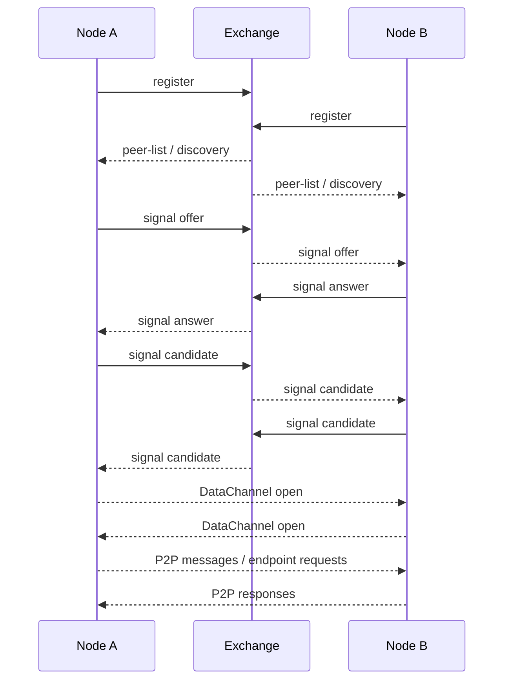

# WebRTC Architecture

This document describes how Reactor implements WebRTC on desktop and Android.

The important split is:

* Exchange is the signaling layer.
* WebRTC is the peer-to-peer transport layer.
* DataChannel is used for the actual direct message exchange once the connection is established.

## High-Level Flow

The expected flow is:

1. Each node connects to Exchange.
2. Exchange keeps track of connected nodes and exposes the peer list.
3. When a peer is discovered, the runtime can start a WebRTC handshake.
4. One side creates an offer.
5. The other side receives the offer and creates an answer.
6. ICE candidates are exchanged through Exchange.
7. When ICE succeeds, the DataChannel opens.
8. Messages and endpoint requests can then move over the direct P2P channel.

## Desktop Implementation

Desktop WebRTC lives in [src/p2pDataChannelManager.js](src/p2pDataChannelManager.js) and is orchestrated by [src/runtime.js](src/runtime.js).

### Responsibilities

* Create and manage `RTCPeerConnection` objects.
* Create the initiator DataChannel.
* Send `offer`, `answer`, and `candidate` packets through Exchange.
* Queue ICE candidates until the remote description is ready.
* Track whether the DataChannel is open.
* Fall back to Exchange when P2P is not available.

### Key Desktop Flow

* `runtime.handleDiscoveredRemotePeers(...)` starts autodial for known peers when P2P is allowed.
* `P2PDataChannelManager.ensureConnected(...)` creates the offer and waits for the channel to open.
* `P2PDataChannelManager.handleSignal(...)` applies incoming `offer`, `answer`, and `candidate` packets.
* `P2PDataChannelManager.sendEnvelope(...)` sends application payloads only after the channel is open.

## Android Implementation

Android WebRTC is implemented in [capacitor/android/app/src/main/java/com/reactor/app/AndroidP2PWebRtcManager.java](capacitor/android/app/src/main/java/com/reactor/app/AndroidP2PWebRtcManager.java) and integrated into the service layer in [capacitor/android/app/src/main/java/com/reactor/app/ReactorHttpService.java](capacitor/android/app/src/main/java/com/reactor/app/ReactorHttpService.java).

### Responsibilities

* Build `PeerConnectionFactory` and `PeerConnection` instances.
* Use Exchange as signaling transport.
* Create the initiator DataChannel on the dialing side.
* Answer incoming offers on the responder side.
* Queue ICE candidates until the remote description is set.
* Expose the current P2P status to the UI.

### Android-specific note

The Android responder must use the real `working-mode.json` relay configuration when creating the peer connection. That file provides STUN, TURN, and TURN credentials.

## Exchange Signaling Layer

Exchange is responsible for discovery and routing only.

Relevant code:

* [src/exchangeManager.js](src/exchangeManager.js)
* [src/runtime.js](src/runtime.js)
* [capacitor/android/app/src/main/java/com/reactor/app/ReactorHttpService.java](capacitor/android/app/src/main/java/com/reactor/app/ReactorHttpService.java)

Exchange does not carry the final direct payload when P2P is active. Instead, it forwards signaling packets like:

* `offer`
* `answer`
* `candidate`
* `connected`
* `failed`
* `close`

## Remote Peer Discovery

The UI network view shows a merged peer list built from:

* Exchange discovery entries
* P2P session state
* Current remote peer list

This is why a peer may appear in the UI before the DataChannel is fully open.

## Endpoint Requests Over DataChannel

Once the DataChannel is open, Reactor can ask a remote node for its endpoints directly.

The flow is:

1. UI selects a remote node.
2. Desktop or Android sends a `endpoints-request` control payload over DataChannel.
3. The remote node responds with `endpoints-response`.
4. The UI renders the returned endpoints in the network view.

This is implemented in:

* [src/runtime.js](src/runtime.js)
* [src/p2pDataChannelManager.js](src/p2pDataChannelManager.js)
* [capacitor/android/app/src/main/java/com/reactor/app/AndroidP2PWebRtcManager.java](capacitor/android/app/src/main/java/com/reactor/app/AndroidP2PWebRtcManager.java)
* [ui/src/routes/+page.svelte](ui/src/routes/+page.svelte)

## Current Status Model

Typical P2P session states:

* `discovered`
* `signaling`
* `connecting`
* `connected-p2p`
* `connected-turn`
* `fallback-exchange`
* `idle`

The UI uses these states to color the network graph and to explain whether a peer is only discovered or actually connected.

## Practical Debugging Notes

If P2P does not open:

* Verify that both nodes are connected to Exchange.
* Verify that both nodes have STUN and TURN configured.
* Verify that the desktop runtime can load `@roamhq/wrtc`.
* Verify that Android uses the real `working-mode.json` values.
* Check whether the remote description is set before ICE candidates are flushed.

If the DataChannel is still not open, the problem is usually one of these:

* signaling packet ordering
* missing STUN/TURN configuration
* ICE candidate timing
* network reachability
* WebRTC module availability on desktop

